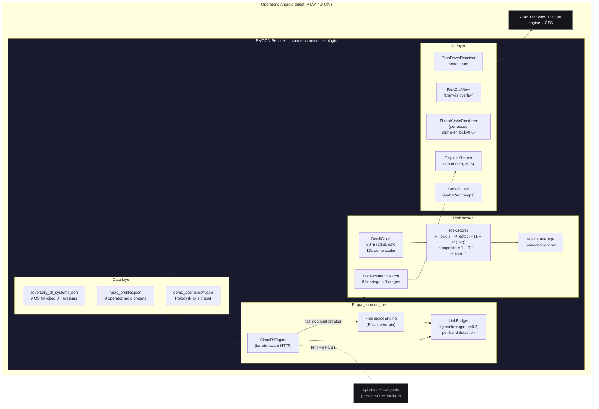

# EMCON Sentinel — architecture

Three views: a polished mermaid diagram (renders on GitHub), an ASCII text view (works in any viewer), and a per-tick data-flow trace.

## System view (mermaid)



## Single-page ASCII (works in any viewer)

```
                       ┌────────────────────────────────────────┐
                       │            Operator's tablet            │
                       │              (Android, ATAK)            │
                       └────────────────────────────────────────┘
                                          │
        ┌─────────────────────────────────┼─────────────────────────────────┐
        │                                 │                                 │
        ▼                                 ▼                                 ▼
┌───────────────┐               ┌───────────────────┐              ┌────────────────┐
│  Inputs       │               │  EMCON Sentinel   │              │  Outputs        │
│  (ATAK gives) │               │      Plugin        │              │  (UI overlays)  │
├───────────────┤               ├───────────────────┤              ├────────────────┤
│ Operator GPS  │  ───────────► │  Data Layer       │              │ Risk Dial      │
│ (selfMarker)  │               │  • adversary lib  │              │ (bottom right) │
│               │               │  • radio profiles │              │                │
│ Map taps      │  ───────────► │  • demo scenarios │              │ Threat Circles │
│ (MAP_CLICK)   │               │                   │              │ (per-asset,    │
│               │               │  Risk Layer       │              │  alpha=P_lock) │
│ Map view      │  ───────────► │  • DwellClock     │ ──────────►  │                │
│ + items       │               │    (50m radius)   │              │ Displace       │
│               │               │  • RiskScorer     │              │ Banner         │
│               │               │    (composite)    │              │ (top, ≥0.5)    │
│               │               │  • 5s smoothing   │              │                │
│               │               │  • Displacement   │              │ Route to       │
│               │               │    Search         │              │ chosen hide    │
│               │               │    (8×3 sample)   │              │ (ATAK Route    │
│               │               │                   │              │  engine)       │
│               │               │  Propagation      │              │                │
│               │               │  • CloudRF API    │ ── HTTPS ──► │ Sound cues     │
│               │               │  • FSPL fallback  │              │ (amber, red)   │
│               │               │  • sigmoid LB     │              │                │
└───────────────┘               └───────────────────┘              └────────────────┘
                                          │
                                          ▼
                              ┌─────────────────────┐
                              │  Optional external  │
                              │   CloudRF API       │
                              │  (terrain-aware     │
                              │   path loss)        │
                              │                     │
                              │  Falls back to FSPL │
                              │  on any failure or  │
                              │  empty API key.     │
                              └─────────────────────┘
```

## Per-tick data flow (1 Hz, 10 Hz under DEMO 10×)

```
         RiskTickLoop.doTick()
                │
                ▼
        Source operator GPS
        (selfMarker → mapView center fallback)
                │
                ▼
        DwellClock.update(now, lat, lon, isKeying)
        ─ accumulates dwell while in-radius + keying
        ─ resets on movement-out or stop-keying
                │
                ▼
        For each PlacedAdversary:
        ┌────────────────────────────────────────────────┐
        │ For each band the radio profile transmits on   │
        │ ─ if adversary covers that band:               │
        │     PathLossEngine.pathLoss(op, adv, freq)     │
        │     → CloudRF (terrain) or FSPL (free-space)   │
        │     LinkBudget.bandDetectionProb               │
        │     → sigmoid(margin_dB) × dutyCycle           │
        │ ─ take max P_detect across overlapping bands   │
        │ ─ P_lock_i = P_detect × (1 − exp(−t/τ_i))      │
        └────────────────────────────────────────────────┘
                │
                ▼
        composite = 1 − Π(1 − P_lock_i)
        smoothed  = MovingAverage(5s).push(composite)
                │
                ▼
        Pushes update to:
        ─ RiskDialView          (numeric + ring color + dwell)
        ─ ThreatCircleRenderer  (per-asset alpha = P_lock × 0.6)
        ─ DisplaceBanner        (visible when smoothed ≥ 0.5)
        ─ SoundCues             (chime on amber/red crossings)
```

## Key invariants

- **All math is pure Java with zero ATAK dependencies.** `data/`, `prop/`, `risk/`, `util/` packages are unit-testable on the laptop without an emulator. 45 JUnit tests, 100% green.
- **The propagation backend is swappable.** `PathLossEngine` is a one-method interface. `FreeSpaceEngine` is the offline-safe default. `CloudRfEngine` is a thin OkHttp/Gson wrapper with a circuit breaker that drops back to FSPL after 3 consecutive failures.
- **State is single-source-of-truth.** `PluginState` (in `ui/`) owns the live mutable state — active radio profile, placed adversaries, keying flag, demo flag, last RiskUpdate. Both the DropDownReceiver (UI thread) and the RiskTickLoop (main Handler) read/write through synchronized accessors.
- **The dial is a custom Canvas View.** No external view dependencies. Attached to the ATAK MapView via `mapView.addView(dial, FrameLayout.LayoutParams)` with bottom-right gravity.
- **Routes go through ATAK's native engine.** `Route.persist(mapEventDispatcher, null, this.getClass())` — no custom route renderer; the operator gets the same UX they get for any ATAK route.
